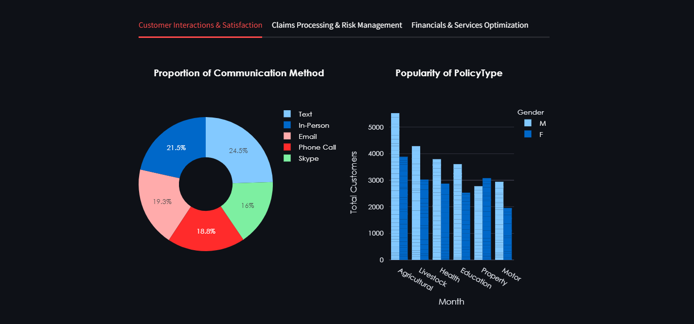
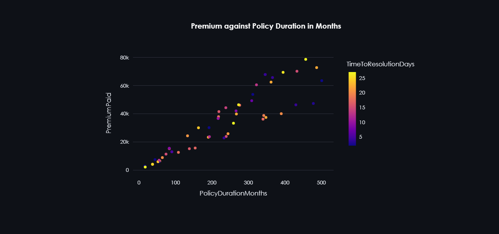
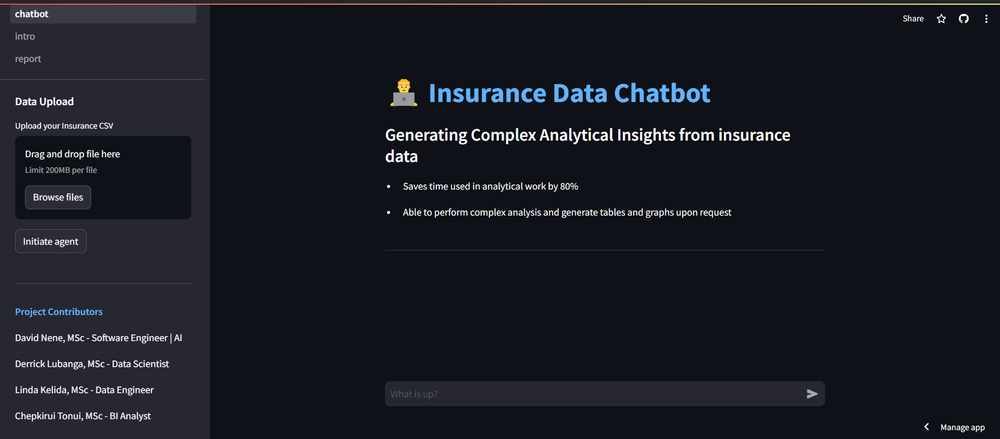
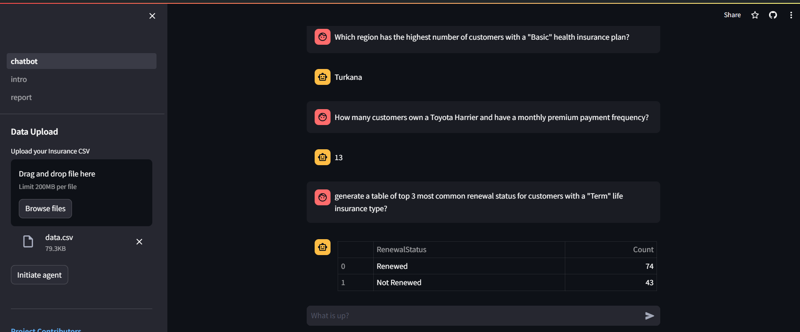

# AKI Insurance Hackathon Project - AI Powered Software by Tunga Team

## Overview
This repository contains the source code for the AI-driven software developed during the AKI Insurance Hackathon. The project leverages a Jupyter notebook analysis, Insights Dashboard and a Chatbot to provide a user-friendly interface where stakeholders can interact directly with data insights and make informed decisions 
quickly.

## Features
- **Data Analysis Notebook**: Contains comprehensive data cleaning and analysis of insurance data including customer demographics, policy details, and claims history.
- **Dashboard**: A dashboard containing a report of insights generated from the insurance dataset.
- **Chatbot**: A chatbot that allows users to query the dataset interactively through a chat interface.
- **AI-Driven Insights**: Utilizes Chat GPT-4 to analyze data and generate actionable insights, enhancing decision-making processes.

## Live Link
https://tunga-chat-hackathon.streamlit.app/

### Reports Page 





### Chatbot Page



### Data Upload


### Text QA



### Visualization Generation QA


## Installation

### Prerequisites
- Python 3.8+
- pip

### Setup (Using bash or Unix terminal)
1. Clone the repository:
   ```bash
   git clone https://github.com/davidnene/tinga-AKI-hackathon.git
   cd tunga-AKI-hackathon
2. Create a virtual environment:
   ```bash
   python -m venv .venv

3. Activate the virtual environment
   ```bash
   . .venv/Scripts/activate
4. Install Dependancies from requirements.txt
   ```bash
   pip install -r requirements.txt
5. Create an environment file
   ```bash
   touch .env
6. Add your Open AI API Key
   ```bash
   echo OPENAI_API_KEY=paste_your_key_here > .env
7. Run streamlit server
   ```bash
   streamlit run intro.py

## Project Contributors
This project was developed by Strathmore University students pursuing a Masters Degree in Data Science and Analytics
1. [David Nene](https://www.linkedin.com/in/davidnene) - Software Engineer|AI
2. [Derrick Lubanga]() - Data Scientist
3. [Linda Kelda]() - Data Engineer
4. [Chepkirui TOnui]() - BI Analyst

## Presentation Date
**10th-May-2024**