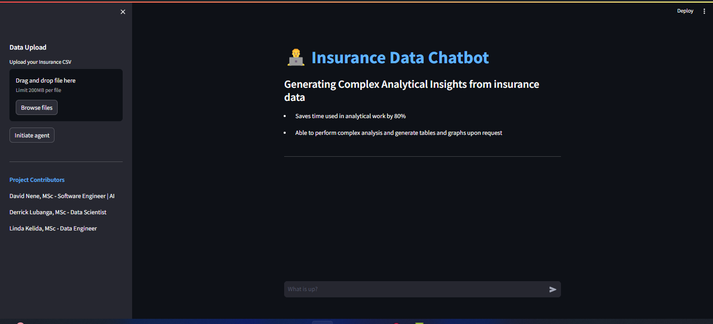
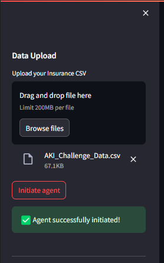

### Home Page



### Data Upload





# AKI Insurance Hackathon Project - Chat CSV Streamlit

## Overview
This repository contains the source code for the AI-driven chatbot developed during the AKI Insurance Hackathon. The project leverages a Jupyter notebook analysis and a Streamlit application to provide a user-friendly interface where stakeholders can interact directly with data insights and make informed decisions quickly.

## Features
- **Data Analysis Notebook**: Contains comprehensive analysis of insurance data including customer demographics, policy details, and claims history.
- **Streamlit Application**: A web application that allows users to query the dataset interactively through a chat interface.
- **AI-Driven Insights**: Utilizes Chat GPT-4 to analyze data and generate actionable insights, enhancing decision-making processes.

## Installation

### Prerequisites
- Python 3.8+
- pip

### Setup
1. Clone the repository:
   ```bash
   https://github.com/davidnene/AKI-hackathon.git
   cd AKI-hackathon
